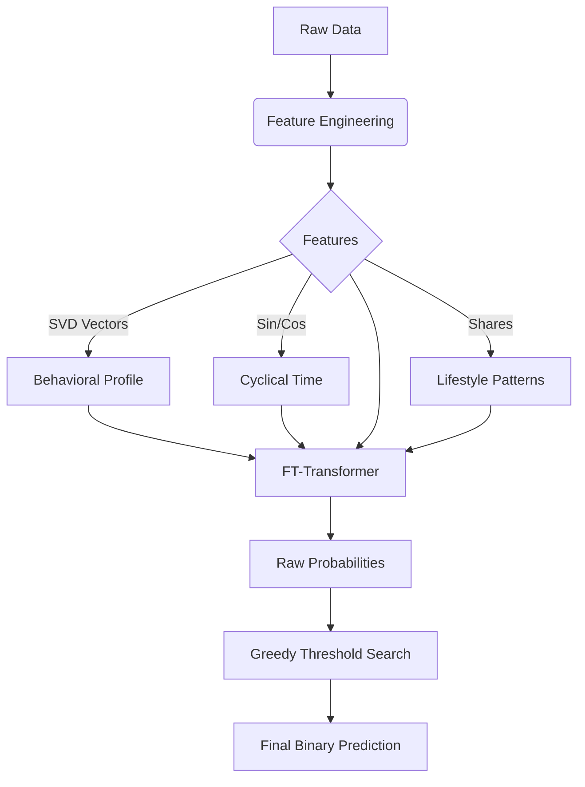
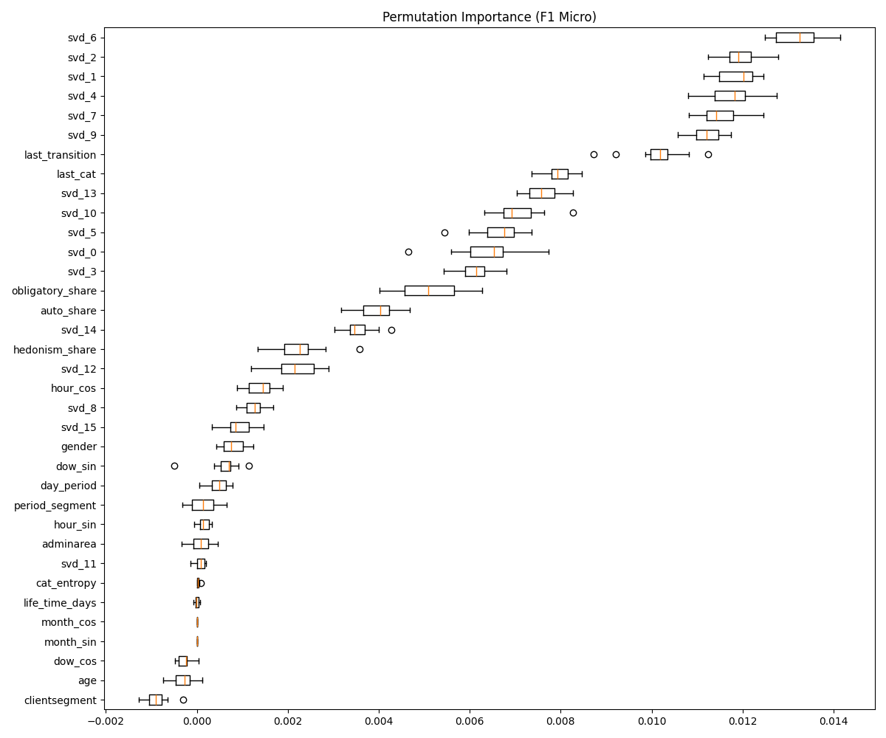
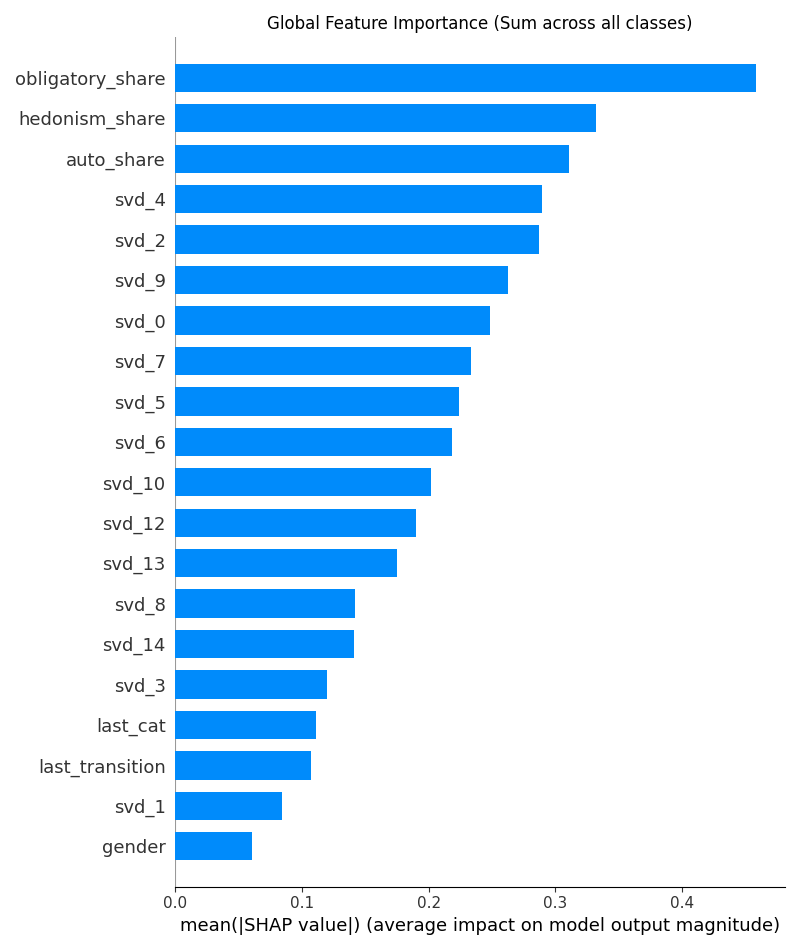
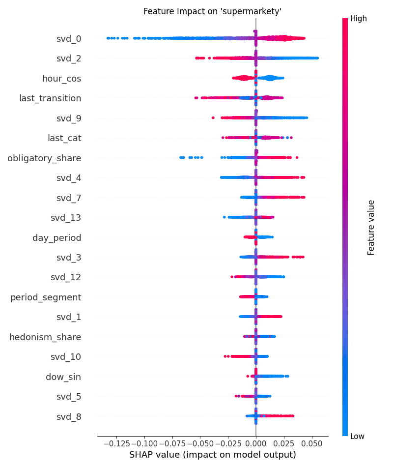

# 🚀 Alfa-Bank Transaction Prediction | FT-Transformer


## 🎯 Описание задачи
Разработка модели Multi-Label классификации для предсказания категорий транзакций (MCC) клиента в следующем периоде. 
Решение базируется на анализе исторических последовательностей транзакций, демографических данных и временных паттернов.

---

## 🏗️ Архитектура решения

В основе решения лежит **FT-Transformer** (Feature Tokenizer Transformer, https://arxiv.org/pdf/2106.11959) — современная архитектура, превосходящая градиентный бустинг на сложных табличных данных. Все признаки проецируются в единое эмбеддинговое пространство размерности 192.



### 🔧 1. Feature Engineering
Вместо сырых данных мы генерируем плотные векторные представления клиента:
*   **Global Context:** TF-IDF векторизация последовательности MCC-кодов + **SVD** (16 компонент) для создания "поведенческого профиля".
*   **Behavioral Ratios:** расчет долей трат в макро-категориях: *"Гедонизм"* (рестораны, развлечения), *"Обязательные"* (ЖКХ, продукты), *"Авто"*.
*   **Cyclical Time Encoding:** Sin/Cos кодирование времени суток, дня недели и месяца.
*   **Sequence Entropy:** оценка предсказуемости и разнообразия трат клиента.

### 🧠 2. Модель (Deep Learning)
*   **Backbone:** `rtdl_revisiting_models.FTTransformer`. Преобразует числовые и категориальные признаки в эмбеддинги и обрабатывает их через Self-Attention блоки.
*   **Loss Function:** **Asymmetric Loss**. Специализированная функция потерь, которая жестко подавляет False Positives (ошибки на нулях) и фокусируется на сложных примерах. Это решает проблему дисбаланса классов лучше, чем Focal Loss. Используется "жесткая" фильтрация легких негативных примеров. https://arxiv.org/abs/2009.14119
*   **Optimization:** AdamW + Linear Warmup Scheduler.

### 🎯 3. Post-Processing (Greedy Optimization)
*   Используется алгоритм **Coordinate Descent (Покоординатный спуск)** для поиска индивидуального порогов (Thresholds) для каждого из 32 классов.
*   Оптимизация проводится напрямую под метрику **Hamming Score** на валидационной выборке.

---

### 🔍 4. Explainable AI (Интерпретируемость)

Решение включает модуль для анализа "черного ящика" модели, позволяющий объяснить причины предсказаний.
* **Permutation Importance:** оценка глобальной важности признаков через перемешивание. Позволяет выделить топ драйверов модели (например, hedonism_share, cat_entropy).
* **SHAP (KernelExplainer):** глубокий анализ влияния признаков.
  * **Global Bar Plot:** cуммарный вклад каждого признака в предсказание всех классов.
  * **Beeswarm Plots:** детализированный анализ для конкретных классов (например, как age влияет на вероятность категории kredity).

Все графики автоматически сохраняются в папку artifacts/.

---

### 📊 Результаты интерпретации (XAI)

Ниже представлены результаты анализа влияния признаков на решения модели, сгенерированные модулем explainability.
* #### **1. Глобальная важность (Permutation Importance)**

  * Оценивает снижение метрики (F1 Micro) при случайном перемешивании значений признака. Позволяет выделить наиболее значимые признаки для модели без привязки к конкретному классу.



Как видно из графика, синтетические признаки (hedonism_share, auto_share), SVD-компоненты истории транзакций и последняя транзакция вносят наибольший вклад.

* #### **2. SHAP Global Summary**

  * Показывает среднее абсолютное влияние каждого признака на предсказание всех 32 классов суммарно.



* #### **3. Детальный анализ класса (SHAP Beeswarm)**

  * Пример влияния признаков на вероятность категории "supermarkety".
        Цвет точки: значение признака (Красный = Высокое, Синий = Низкое).
        Положение по оси X: влияние на предсказание (Справа = Повышает вероятность, Слева = Понижает).




## 📂 Структура проекта

```text
alfa-predict-next-transactions/
├── Dockerfile             # Окружение (PyTorch 2.6, CUDA 11.8)
├── docker-compose.yml     # Конфигурация запуска с GPU
├── LAUNCH_INSTRUCTIONS.md # Инструкция по запуску
├── requirements.txt       # Зависимости
├── run.sh                 # Единый скрипт запуска (One-click start)
├── tests/                 # Unit-тесты
├── data/                  # Исходные данные и маппинги
├── artifacts/             # Сохраненные модели и словари
├── src/                   # Исходный код
│   ├── config.py             # Конфигурация путей и гиперпараметров
│   ├── dataset.py            # Потоковая обработка (Streaming Dataset)
│   ├── model.py              # Архитектура FTT и AsymmetricLoss
│   └── utils.py              # Утилиты и метрики
└── scripts/               # Исполняемые пайплайны
    ├── 1_prepare_data.py     # Подготовка данных (SVD, Split)
    ├── 2_train.py            # Обучение модели
    ├── 3_optimize.py         # Валидация и поиск порогов
    ├── 4_predict.py          # Финальный инференс
    └── 5_explain.py          # Анализ и интерпретация (XAI)
